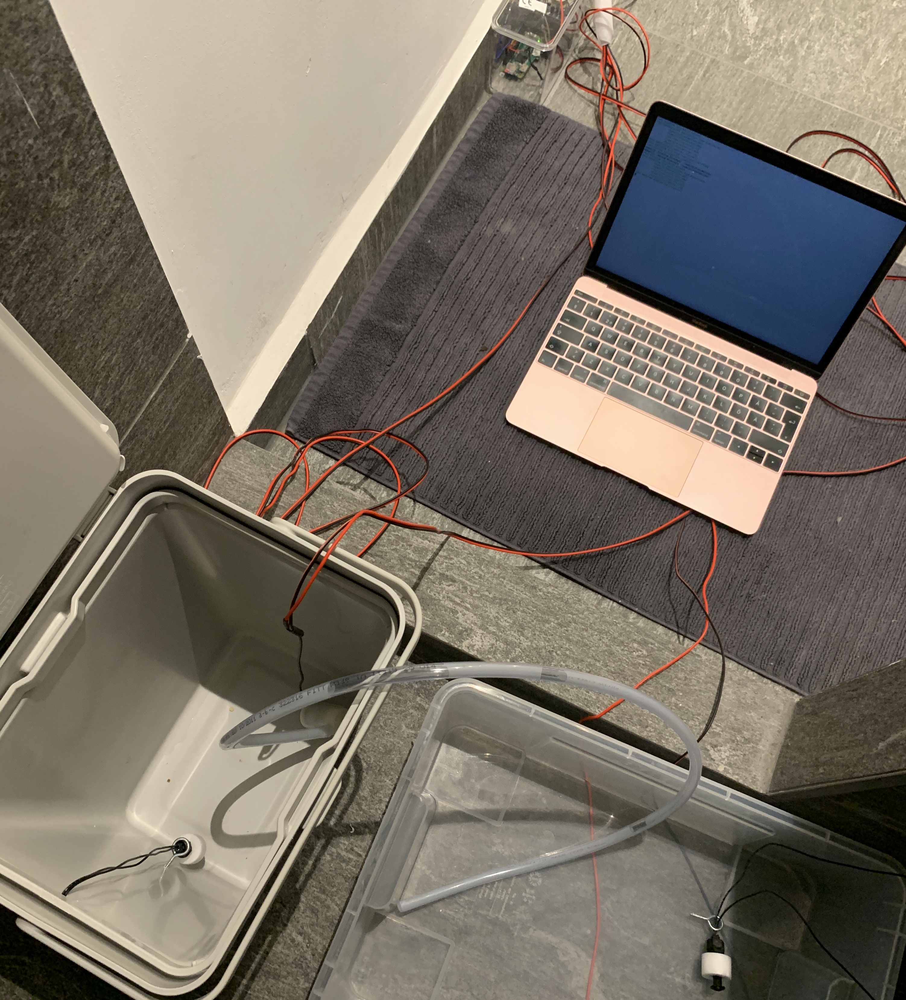
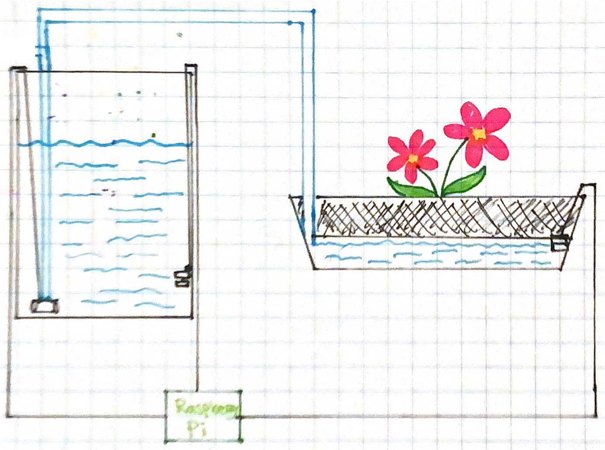
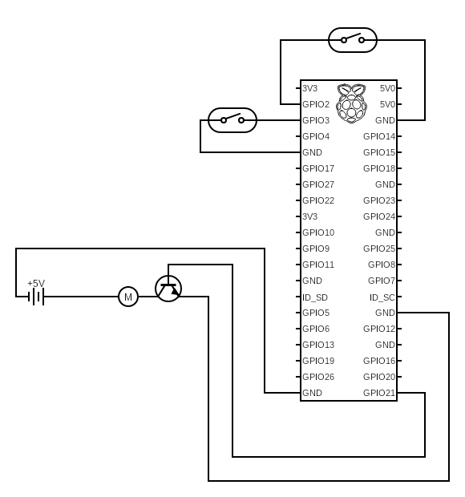

# 🌵 ➡️ 🌸 PlantWatcher

This project is for my own personal use and I take no responibility for any incident of killed plants or flooded apartments.

## 💡 Background

When I last year got my first apartment with a balcony, I realized that keeping the plats from dying wouldn't be as easy as it seems. After killing off several of them during my first months in Berlin (where the weather, in fact, is pretty warm and sunny during the summer months), I concluded that I would need a watering system.

My little pet project went, as they often tend to do, totally out of hand. After more than a few weekends in lockdown, and a winter break, I ended up with the following solution for my balcony.


    
*The setup of the testing done in January, a "nicer" photo will be uploaded as soon as the snow is gone...*

## 🎨 Design

1. A pump is pumping water from a bucket (or any water source) to a flower pot with a built-in manual irrigation system.
2. A floating meter is attached to the bottom of a bucket. If the bucket would be empty - the pump won't start at all.
3. A floating meter is attached to a flower pot. If the floating meter indicate that more water is needed, the pump will start pumping water from the bucket over to the flower pot.



## 🛰 Hardware

- 1 x [RaspberryPi Zero](https://www.electrokit.com/en/product/relay-module-5v/raspberry-pi-zero-w-board-2)
- 1 x [Water pump mini 5V](https://www.electrokit.com/en/product/relay-module-5v/vattenpump-mini-5v)
- 2 x [Float switch magnetic NO](https://www.electrokit.com/en/product/relay-module-5v/float-switch-magnetic-no)
- 1 x [Relay module 5V](https://www.electrokit.com/en/product/relay-module-5v)
- [Speaker cables](https://www.electrokit.com/en/product/relay-module-5v/kabel-2x4-0-rod-svart-m) (I used about 4-5 meters for my setup, and it was more than enough)
- [Flower pot with irrigation system](https://www.obi.de/pflanzentoepfe-aussen/ebertsankey-blumenkasten-mediterran-mit-bewaesserungssystem-100-cm-anthrazit/p/4444444)
- 1 x [bucket](https://www.ikea.com/de/de/p/hallbar-behaelter-mit-deckel-hellgrau-80398058)

### Notes
1. If you're brave enough and trust that your code is bug-free, a [liquid valve](https://www.electrokit.com/en/product/plastic-water-solenoid-valve-1-2-12v/) or similar could replace the pump.
2. If another type of flower pot would be needed, the second floating meter could be exchanged to a [soil hygrometer module](https://www.electrokit.com/en/product/soil-hygrometer-module/) or a [flow sensor](https://www.electrokit.com/en/product/flodesmatare-1-30l-m-1-2-2/).

### Hardware assembly



_Created with [https://www.circuit-diagram.org/editor/](https://www.circuit-diagram.org/editor/)_

Please note that I've never studied electrical engineering and that the following circuit diagram could be way off. Use common sense while assembling.

## 👩‍💻 Software

Feel free to use and abuse the code however you like.

🌸 For reading from the GPIO pins, I use my **[pigpio library](https://github.com/mmalmsten/pigpio)**.

### Prerequisites

The pigpio C library (http://abyz.me.uk/rpi/pigpio/)

### Getting started

**Install Erlang**

```
sudo apt-get install erlang
```

**Install the pigpio library**

```
sudo apt-get install pigpio
```

**Install pigpio**

```
sudo apt-get install pigpio python-pigpio python3-pigpio
```

**Start the pigpio daemon**

```
sudo pigpiod
```

**Start the web server**

```
make run
```

An API skeletton is running on port 3000.

### References

Erlang socket bindings to pigpio: https://github.com/skvamme/pigpio
