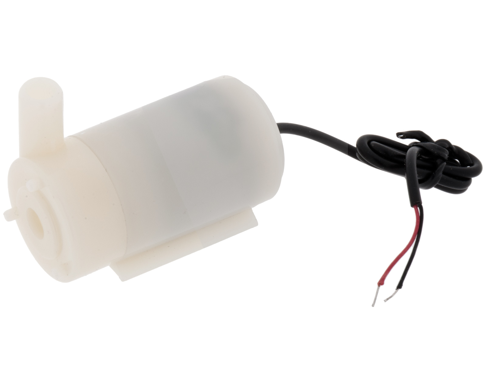
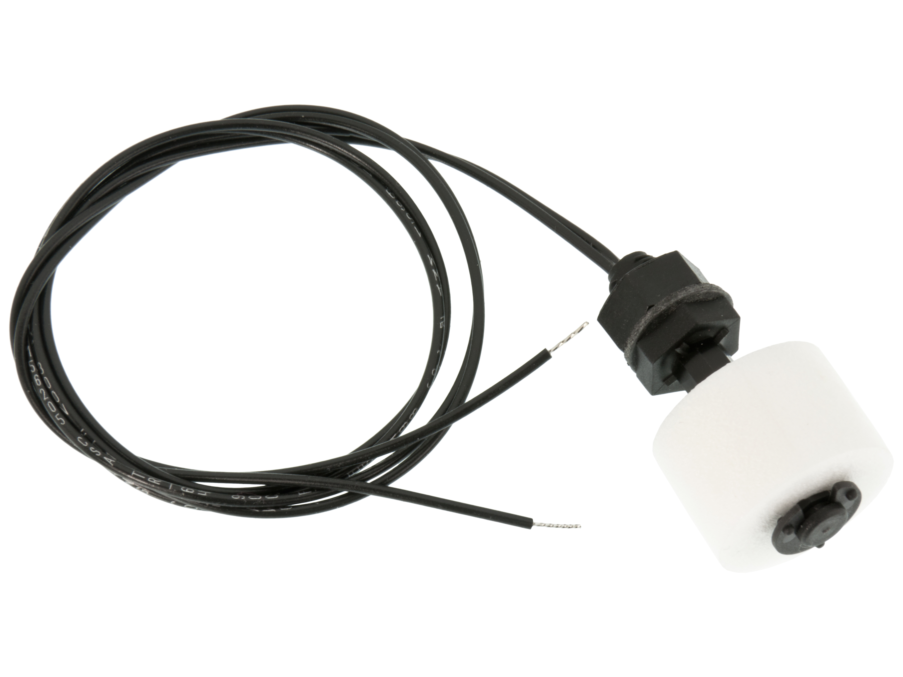

# 🌵 ➡️ 🌸 PlantWatcher

When I got my first apartment with a balcony, I realized that there are challenges in life that I didn't think would be as problematic, e.g. keeping plants alive during a warm summer week. After killing off a number of plants during my first half a year in Berlin, I decided that this should never happen again - hence the PlantWatcher.

🛰 The PlantWatcher is intended to run on a RaspberryPi Zero.

⚠️ The code is written for my own personal use and I take no responibility for any incident of killed plants or flooded apartments.

🙏 Many thanks to [skvamme](https://github.com/skvamme) for letting me fork her implementation on accessing GPIO on a raspberry pi with http://abyz.me.uk/rpi/pigpio/ and Erlang.

## Hardware used

- RaspberryPi Zero
- [L298 DC Motor Driver Board](https://www.m.nu/servo-motorer-robotics/l298-dc-motor-driver-board)
- [Vattenpump mini 5V](https://www.electrokit.com/produkt/vattenpump-mini-5v/)
- 2 x [Flottörbrytare magnetisk NO](https://www.electrokit.com/produkt/flottorbrytare-magnetisk-no/)

<div style="text-align: center;">
    
    
    
</div>

## Prerequisites

The pigpio C library (http://abyz.me.uk/rpi/pigpio/)

## Getting started

**Assemble the sensors**

**Install Erlang**

```
sudo apt-get install erlang
```

**Install the pigpio library**

```
sudo apt-get install pigpio
```

**Install pigpio**

```
sudo apt-get install pigpio python-pigpio python3-pigpio
```

**Start the pigpio daemon**

```
sudo pigpiod
```

**Edit config file**

**Start the server**

## References

Erlang socket bindings to pigpio: https://github.com/skvamme/pigpio
